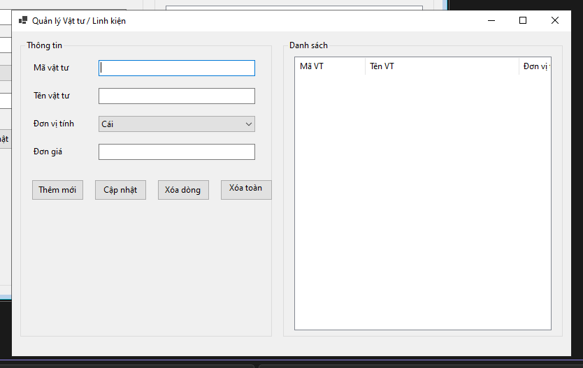
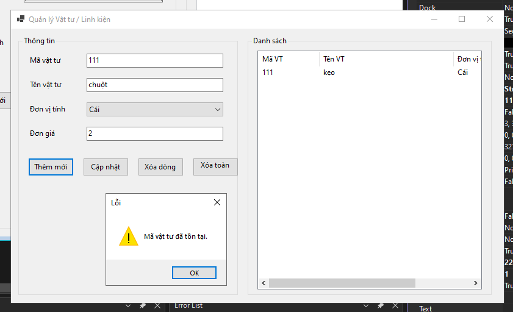
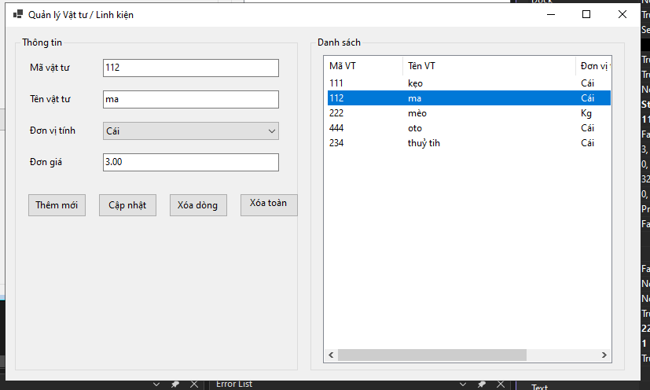
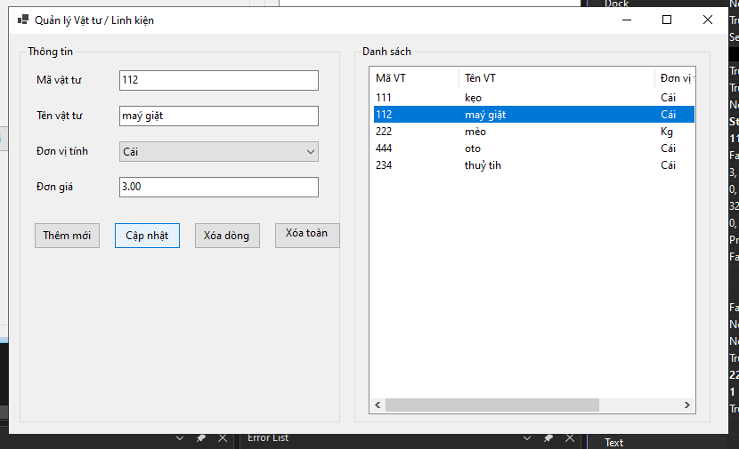
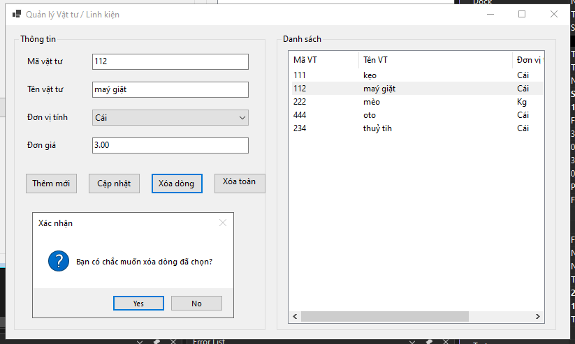
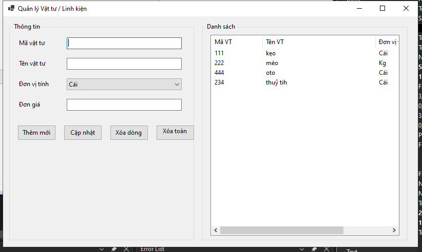

# BÁO CÁO BÀI TẬP

## THÔNG TIN SINH VIÊN
- **Họ và tên: Đặng Cao Thành Đạt**
- **Mã số sinh viên: 24810320215** 
- **Lớp: D19QTANM1** 
- **Tên môn học: Lập Trình.Net** 
- **Tên bài tập: Bài 3: Quản lý danh mục Vật tư / Linh kiện (Item List Manager)** 

---

## KẾT QUẢ THỰC HÀNH

### 1. Ảnh màn hình Giao diện chính

### 2. Validate: Không cho phép thêm nếu Mã VT đã tồn tại trong ListView.

### 3.1 Khi chọn (Select) 1 dòng trong ListView, tự động đẩy dữ liệu của dòng đó ngược lại các ô TextBox/ComboBox bên trái để chỉnh sửa.

### 3.2 Khi chọn (Select) 1 dòng trong ListView, tự động đẩy dữ liệu của dòng đó ngược lại các ô TextBox/ComboBox bên trái để chỉnh sửa.

### 4.1 Khi nhấn "Xóa dòng", hiển thị MessageBox xác nhận dạng (Yes/No) trước khi xóa.

### 4.2 Khi nhấn "Xóa dòng", hiển thị MessageBox xác nhận dạng (Yes/No) trước khi xóa.

